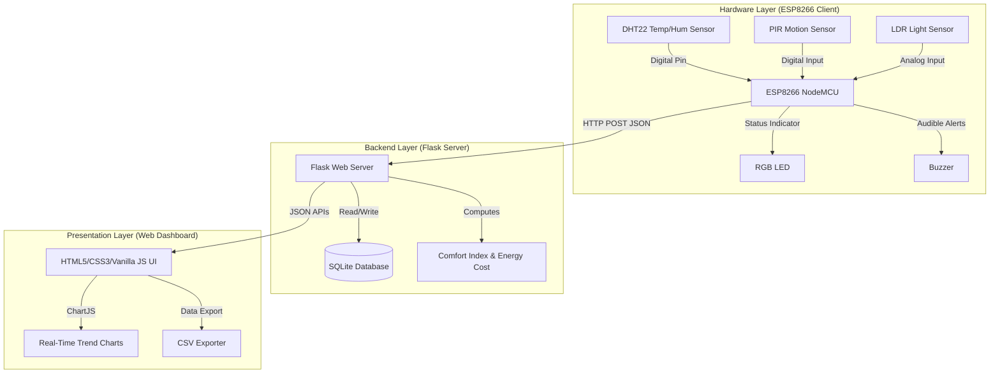

# ComfortSense: Smart Office IoT Environmental Monitoring & Automation System

ComfortSense is a comprehensive, real-time environmental monitoring and workspace automation system designed for modern smart offices. The project features an **ESP8266 NodeMCU** hardware client that publishes live environmental readings to a **Python Flask** backend. The backend computes efficiency and comfort metrics (such as a custom Comfort Score and live Energy Cost estimations) and stores them in an **SQLite** database, while a dynamic **Web Dashboard** displays real-time charts, thresholds alerts, and CSV exports.

This project was built to showcase the integration of low-cost hardware sensors with clean, responsive full-stack software, and has been prepared for submission to **Electronics For You (EFY) Magazine**.

---

## 📸 Dashboard Preview

> [!NOTE]
> The dynamic web frontend updates in real-time as the hardware pushes new data. It features responsive CSS, visual gauge indexes, historical trend charts, and an exportable history log.

```
+-----------------------------------------------------------------------+
|  🏢 COMFORTSENSE SMART OFFICE DASHBOARD                 [Active]      |
+-----------------------------------------------------------------------+
|  [ 🌡️ Temp: 24.5°C ]   [ 💧 Humidity: 52% ]   [ 💡 Light: 650 lx ]    |
|  [ 🚶 Occupants: 3 ]   [ ⚡ Energy Cost: ₹4.2 ] [ 📊 Comfort: 98% ]   |
+-----------------------------------------------------------------------+
|  [ Alerts: None ]                                   [Export CSV]      |
+-----------------------------------------------------------------------+
```

---

## 🛠️ System Architecture

The system operates across three primary layers:



---

## 🔌 Hardware Specifications & Pinout

The hardware client is built around the **ESP8266 NodeMCU** microchip. It reads ambient data and triggers local indicator output depending on room status and configured thresholds.

### Wiring Reference

| Component | Description / Purpose | NodeMCU Pin |
| :--- | :--- | :--- |
| **DHT22** | Temperature & Humidity Sensor | `D4` |
| **PIR Sensor** | Motion detection for room occupancy | `D7` |
| **LDR (Light)** | Ambient light level reading (with 10KΩ resistor divider) | `A0` |
| **RGB LED** | Visual status (Common Anode: R=`D1`, G=`D2`, B=`D6`) | `D1`, `D2`, `D6` |
| **Buzzer** | High-humidity audible alarm | `D5` |
| **Power** | 3.3V power rails and Ground connection | `3V3` / `GND` |

---

## ⚙️ Core Logic & Rule Thresholds

### 1. Thermal Comfort Alerts
*   **Green LED (Optimal)**: Temp: $20^\circ\text{C} \le T < 27^\circ\text{C}$ and Humidity: $40\% \le H < 60\%$
*   **Yellow LED (Warning)**: Temp: $27^\circ\text{C} \le T < 30^\circ\text{C}$ or Humidity: $60\% \le H < 70\%$
*   **Red LED (Critical)**: Temp $\ge 30^\circ\text{C}$ or Humidity $\ge 70\%$. When critical, the local buzzer will sound once every 10 seconds.

### 2. Adaptive Lighting Control
To conserve energy, the room's primary lighting controller (represented by the white LED) is automated using both light levels and human detection:
$$\text{State} = \begin{cases} \text{ON (Inverse Brightness)}, & \text{if Occupants} > 0 \text{ AND LDR} < 150 \\ \text{OFF}, & \text{otherwise} \end{cases}$$
The light level adjusts dynamically:
$$\text{Brightness} = \text{Map}(\text{LDR}, 0, 150, 255, 0)$$

### 3. Backend Computed Features
*   **Comfort Score ($0-100\%$)**: Devised using a weighted formula calculating deviations from ideal conditions ($25^\circ\text{C}$ and $50\%$ relative humidity).
*   **Energy Cost Estimation**: Computes cumulative power costs of operating workspace lights based on time active:
$$\text{Cost} = (\text{LED Wattage} \times \text{Hours Active}) \times \text{Rate per kWh}$$
*   **Security Alert (Suspicious Activity)**: Raised if the PIR motion sensor registers movement while the official occupant count is $0$.

---

## 📁 Repository Structure

```
Comfort-Sense/
├── app.py                  # Flask backend web server & API endpoint
├── simulate_sensors.py     # Python script to simulate hardware data (for testing)
├── db_check.py             # Simple SQLite utility helper
├── qr.py                   # QR Code generator script
├── SENSOR_THRESHOLDS.md    # Detailed sensor threshold tables
├── HARDWARE_GUIDE.md       # Complete electronics connection and wiring instructions
├── SYSTEM_EXPLANATION.txt  # Human-readable walkthrough of the logic
├── requirements.txt        # Python dependency manifest
├── static/
│   ├── css/style.css       # Premium dashboard theme styling
│   └── js/app.js           # Real-time Web sockets/polling update scripts
├── templates/
│   └── index.html          # Web dashboard structure
└── sketch_feb5b/
    └── sketch_feb5b.ino    # Complete C++ code for NodeMCU ESP8266
```

---

## 🚀 Setup & Installation

### 1. Flask Backend Setup
1. Clone the repository:
   ```bash
   git clone https://github.com/alexander-devstack/Comfort-Sense.git
   cd Comfort-Sense
   ```
2. Install Python dependencies:
   ```bash
   pip install -r requirements.txt
   ```
3. Start the server:
   ```bash
   python app.py
   ```
   The application dashboard will be hosted locally at `http://localhost:5005`.

### 2. ESP8266 NodeMCU Firmware Setup
1. Open the [sketch_feb5b.ino](sketch_feb5b/sketch_feb5b.ino) file inside the Arduino IDE.
2. Ensure you have installed the `ESP8266WiFi` and `DHT` sensor libraries.
3. Update your WiFi SSID, password, and the backend server's IP address:
   ```cpp
   const char* ssid = "YOUR_WIFI_SSID";
   const char* password = "YOUR_WIFI_PASSWORD";
   const char* serverURL = "http://YOUR_SERVER_IP:5005/api/update";
   ```
4. Choose your board (`NodeMCU 1.0 (ESP-12E Module)`), select the appropriate serial COM port, and upload.

---

## 📝 License
This project is open-source under the **MIT License**. Feel free to use, modify, and distribute it.
